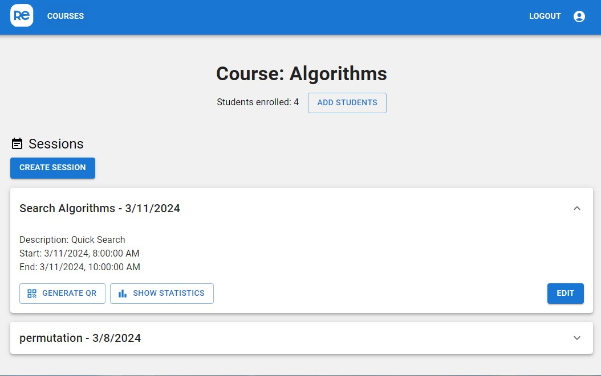
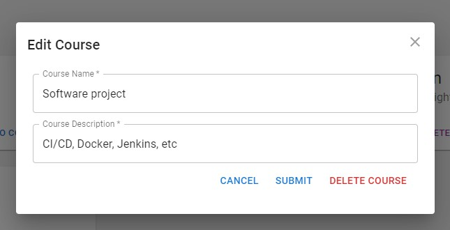

# The Instant Review Software "ReflectEd"

## Table of Contents

- [Team](#team)
- [Introduction](#introduction)
- [Features](#features)
- [Technology Stack](#technology-stack)
- [Screenshots](#screenshots)
- [Getting Started](#getting-started)
  - [Prerequisites](#prerequisites)
  - [Installation](#installation)
  - [Usage](#usage)
- [UML Diagrams / Architecture](#uml-diagrams--architecture)
- [Contributing](#contributing)
- [FAQ](#faq)
- [Acknowledgments](#acknowledgments)

### Team

The Instant Review Software was brought to life by:

- **Arman Yerkeshev** - _Lead Developer_ - [GitHub](https://github.com/A-Yerkeshev) - [LinkedIn](https://www.linkedin.com/in/arman-yerkesh-29b8a7165/)
- **Anna Linden** - _Full Stack Developer_ - [GitHub](https://github.com/AnnaLinden) - [LinkedIn](https://www.linkedin.com/in/anna-linden-software-developer/)
- **Artur Golavskiy** - _Full Stack Developer_ - [GitHub](https://github.com/arturgola) - [LinkedIn](https://www.linkedin.com/in/artur-golavskiy/)
- **Dung Pham** - _Full Stack Developer_ - [GitHub](https://github.com/dungdpham)

## Introduction

The Instant Feedback Software is designed for teachers at different educational institutions, aiming to improve their lecture quality through timely student feedback. This web application allows students to provide immediate responses post-lecture, enabling educators to adapt and evolve their teaching methods effectively. Unlike traditional end-of-course feedback, this tool offers real-time insights into lecture performance, helping teachers identify successful topics and teaching styles.

The teacher has the possibility to sign up, log in, and create courses. Inside each course, the teacher can create sessions. For each session the teacher can generate a QR code.

Students can scan a QR code and leave a review for the session using their phone. The review involves a color assessment (red, green and yellow) and a voluntary comment. Each student can leave only one review per one session.

## Features

**Continuous Integration/Deployment (CI/CD)**

- **Auto Testing:** Every update is automatically tested with Jenkins, reducing bugs.
- **Easy Deployment:** Docker makes putting the project live simple and consistent.

**Real-time Feedback**

- **Quick Feedback:** Teachers get student feedback right after classes.
- **Anonymous:** Students can give honest feedback safely.

**Secure Login**

- **Protected Access:** Uses JWT tokens to keep logins safe.
- **Different User Types:** Students and teachers see different things on the app.

**User-Friendly Design**

- **Looks Good on Any Device:** Thanks to Material-UI, the app works well on phones, tablets, and computers.
- **Easy to Use:** Designed to be straightforward for everyone.

**Multilingual Support**

- **Languages:** The app is available in English, Finnish, Russian, and Vietnamese, making it accessible to a wider audience.
- **Dynamic Language Switching:** Users can switch languages seamlessly within the app, enhancing usability and comfort.

**Insights for Teachers**

- **Track Progress:** Teachers can see how they're doing over time.
- **Visual Data:** Feedback is shown in charts, making it easy to understand.

**Tech Quality**

- **Well-Organized:** Built with MERN (MongoDB, Express.js, React, Node.js) for a clean setup.
- **Thoroughly Tested:** Uses Jest, Mocha, and Chai for testing to make sure everything works.
- **High Code Standards:** ESLint helps keep the code clean and easy to work with

## Technology Stack

This project leverages a robust stack designed for scalability, efficiency, and ease of use. Below is an overview of the primary technologies and tools utilized:

### MERN Stack

-  **MongoDB**: A document-based open source database.
-  **Express.js**: A fast, unopinionated, minimalist web framework for Node.js.
-  **React**: A JavaScript library for building user interfaces.
-  **Node.js**: A JavaScript runtime built on Chrome's V8 JavaScript engine.

### CI/CD & DevOps

-  **Jenkins**: An open-source automation server that enables developers around the world to reliably build, test, and deploy their software.
-  **Docker**: A set of platform-as-a-service (PaaS) products that use OS-level virtualization to deliver software in packages called containers.

### Authentication

-  **JWT Tokens**: Securely transmitting information between parties as a JSON object.

### UI/UX

-  **Material-UI**: A popular React UI framework featuring React components that implement Google's Material Design.

### Testing & Development

- **Jest**: A delightful JavaScript Testing Framework with a focus on simplicity.
- **Supertest**: A Super-agent driven library for testing HTTP servers.
- **Mocha/Chai**: A flexible testing framework for asynchronous testing.

### Code Quality

- **ESLint**: A tool for identifying and reporting on patterns found in ECMAScript/JavaScript code.

## Screenshots

<p align="center"><i>Login Page</i></p>


<p align="center"><i>Courses page</i></p>


<p align="center"><i>Sessions page</i></p>



<p align="center"><i>Editing Modal</i></p>



<p align="center"><i>Statistics</i></p>


<p align="center"><i>QR page</i></p>


<p align="center"><i>Feedback form</i></p>


## Getting started

### Prerequisites

- Ensure you have Node.js and npm installed on your system.

### Installation

**Backend Setup:**

1.  **Navigate to the backend directory:**

```bash
cd backend
```

2.  **Install dependencies:**

```bash
npm install
```

3.  **Create a `.env` file in the `backend` directory with the following variables:**

```plaintext
PORT=4000
MONGO_URI=<your_mongodb_connection_string>
MONGO_URI_TEST=<your_mongodb_test_connection_string>
JWT_SECRET=<your_jwt_secret>
```

Replace `<your_mongodb_connection_string>`, `<your_mongodb_test_connection_string>`, and `<your_jwt_secret>` with your actual MongoDB connection strings and JWT secret. 4. **Start the backend server:**

```bash
 npm run dev
```

**Frontend Setup:**

1.  **Navigate to the frontend directory:**

```bash
 cd ../frontend
```

2.  **Install dependencies:**

```bash
 npm install
```

3.  **Create a `.env` file in the `frontend` directory with the following variable:**

REACT_APP_BACKEND_URL=http://localhost:4000

This variable connects the frontend application to your backend server. 4. **Start the frontend application:**

```bash
 npm start
```

Your default web browser should open automatically to `http://localhost:3000`.

### Usage

After installation, open `http://localhost:3000` in your browser to access the application. Teachers can create lectures and view feedback, while students can submit feedback post-lecture.

In order to run unit tests run `npm test` commands both in frontend and backend directories. To run integration tests, go to backend directory and run `npx playwright test`.

## Screenshots

## UML Diagrams / Architecture

<p align="center"><i>ER Diagram</i></p>


<p align="center"><i>Relational Schema</i></p>


<p align="center"><i>Use Case Diagram</i></p>


<p align="center"><i>Activity Diagram</i></p>


<p align="center"><i>Sequence Diagram</i></p>


<p align="center"><i>Deployment Diagram</i></p>


## Contributing

We welcome contributions from everyone who wants to improve ReflectEd. Here's how you can contribute:

- **Report Bugs:** If you find a bug, please create an issue in our GitHub repository describing the problem, how to reproduce it, and any other relevant details.
- **Suggest Enhancements:** Have ideas on how to make ReflectEd better? Share your suggestions by opening a new issue.
- **Submit Code:** You can contribute directly by submitting pull requests with code changes. Whether it's fixing bugs, adding new features, or improving the documentation, your help is appreciated.

If you're new to contributing to open-source projects, feel free to reach out to us, and we'll be happy to help you get started.

Thank you for considering contributing to ReflectEd. Your support helps us make the software better for everyone

## FAQ

**Q: Can I use this software for any educational institution?**
A: Yes, the Instant Review Software is designed to be versatile and adaptable for various educational settings.

## Acknowledgments

### Team

The Instant Review Software was brought to life by:

- **Arman Yerkeshev** - _Lead Developer_ - [GitHub](https://github.com/A-Yerkeshev) - [LinkedIn](https://www.linkedin.com/in/arman-yerkesh-29b8a7165/)
- **Anna Linden** - _Full Stack Developer_ - [GitHub](https://github.com/AnnaLinden) - [LinkedIn](https://www.linkedin.com/in/anna-linden-software-developer/)
- **Artur Golavskiy** - _Full Stack Developer_ - [GitHub](https://github.com/arturgola) - [LinkedIn](https://www.linkedin.com/in/artur-golavskiy/)
- **Dung Pham** - _Full Stack Developer_ - [GitHub](https://github.com/dungdpham)

- Thanks to Metropolia University of Applied Sciences for supporting this project.
